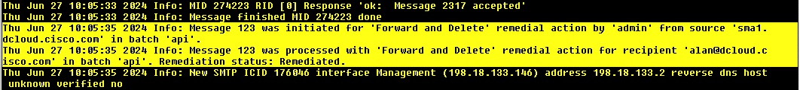

# Cisco Email Threat Defense (ETD) - Remediation script (without M365)

Cisco ETD is a cloud AI/ML driven email security system that was meant to make security administrator life easier with all the automated detection and remediation features. ETD needs to integrate with Microsoft 365 mailboxes in order to perform remediation action. If you are using M365 & ETD, you DONT'T need this script. If you somehow use ETD without M365, this script can help to close gap by sending remediation request to Cisco SMA, which then make use of the SMA/CES/ESA Search-and-Remediate (SAR) integration to remove convicted email from end Exchange mailboxes. 

Cisco ETD convicts emails with all four security threat verdicts (BEC, Scam, Phishing, Malicious). Standard recommendations on ETD is to quarantine these emails automatically using the native ETD remediation features, under the hood is to send API request to M365 to perform these removal/quarantine action. Without M365, remediation becomes a challenge as ETD can only see, but not act on the convited email. This script is trying to close the gap by being the middle man between ETD and SMA. It starts by pulling ETD convicted email, loop through the JSON output, and send remediation request to SMA for each convicted email. This script shall be scheduled to run at an interval, say every 5minutes to automate the remediation of the convicted emails. 


Release update 
- 27th June 2024 - First release of the script 


Pre-requisite:-

* Mac/Linux/Windows with Python (v3.6+)
* Scheduling function, e.g. cron on Linux, or Task Scheduler on Windows
* SMA with Search-and-Remediate configured
* Working Python & library
  - datetime, timedelta
  - json
  - requests
  - time
  - base64
  - urllib3
* ETD API client credential and API Key - (From ETD -> Administration -> API Clients)
* SMA admin credential
* Knowing your ETD instance location (check from the ETD URL)


The python library should be from the standard package. If it is not there, then install with pip, example:-
```bash
pip3 install requests
```


## Installation (required)

The main project file will be 'ETD_remediation.py' script. Here are the steps to prepare and run the script.

1. Complete the prerequisites, check the library above, get ETD API key, client credential and SMA admin credential
2. Installation - Clone the repo
3. Configuration - Edit the script, fill up API client credentials, SMA admin credential, optional forwarding address and the instance URL (if required)
4. Execute the script
5. Schedule the script


Clone the repo
```bash
git clone https://github.com/ciscoketcheon/ETD-Remediation.git
```
Go to your project folder
```bash
cd ETD-Remediation
```
You may start editing the script using your favourite editor. Example:-
```bash
vi ETD-remediation.py
```


## Configuration (required)

1. ETD API client credentials

Mandatory field is client_id, client_password and api_key example
```bash
api_key = "twBJkLMj8l3pmMWtxxxxxxxxxxxxxxxxxxx"
client_id = "ac6991c4-df45-xxxx-xxxx-xxxxxxxxx"
client_secret = "PxVRzLALsETnyrZri9oLiZ_xxxxxxxxxxxxxxxxxxxxxxxxxxxxxxx"
```
The rest of API URL is pre-populated with beta instance (api.beta.etc.cisco.com), if you are using other instances, e.g. apjc, then use (api.apjc.etc.cisco.com) 


2. SMA admin credentials

You can create separate admin accounts for this purpose. From SMA -> System Administration -> Users
```bash
username = "smaapi"
passphrase = "smaapipassword"
```


3. SMA URL

SMA IP/URL, the port 4431 and the path after that is fixed. Example if your SMA is 192.168.1.10, then it will be:-
```bash
remediation_url = 'https://192.168.1.10:4431/sma/api/v2.0/remediation'
login_url = "https://192.168.1.10:4431/sma/api/v2.0/login"
```


4. Optional forwarding email address

The remediated email will be forwarded here. Recommended to add a forwarding address so that you can keep an eye on what has been remediated. Example to forward to -> ben@dcloud-out.cisco.com,look for this variable in the function of remediate_message and within the remediation_payload. 
```bash
def remediate_message(jwt_token, result):
    remediation_payload = {
        "data": {
            ...
            "fwd_email_address": ["ben@dcloud-out.cisco.com"],   # optionally forward to email address
            ...
```


5. Remediation interval

Email takes some time to appear in SMA, hence setting a 5 minutes gap and only remediate convicted email 5 minutes window earlier. 

For example, the time now is T, the search start time is T-10, search end time is T-5, means we are remediating only between that 5 minutes window. Tune this number for desired outcome.
```bash
...
absolute_time = datetime.utcnow()
current_time = absolute_time - timedelta(minutes=5)
start_time = absolute_time - timedelta(minutes=10)
...
```


## Usage (required)

Execute with python
```bash
python3 ETD_remediation.py
```


## Schedule 

My sample cron job to run every 5minutes
```bash
crontab -e

*/5 * * * *     python3 ~/ETD_Remediation/ETD_remediation.py
```


## How do I know it works? 

Unfortunately, you CAN'T tell if the email remediated from the script output itself, as it only returns a success 200 code which indicates the successful script run. Recommended to check for direct mail_logs at ESA to verify that the remediation succeeded. The other method is to check the remediation report from SMA. 

Sample ESA logs:-


Sample SMA Remediation report (Monitoring -> Remediation Report) :-

\


## References and useful links
ETD Guide -> https://www.cisco.com/c/en/us/td/docs/security/email-threat-defense/user-guide/secure-email-threat-defense-user-guide/intro.html

ETD API Guide -> https://developer.cisco.com/docs/message-search-api/

SMA/CES/ESA Remediation Guide -> https://docs.ces.cisco.com/docs/mailbox-auto-remediation-mar

